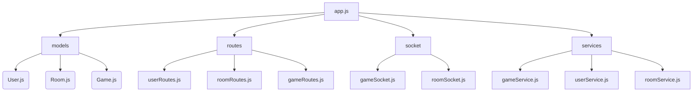

# Documentation 

## Aperçu du Jeu
**"4x20+15"** est un jeu de cartes multijoueur où les joueurs doivent éviter d'atteindre une valeur totale de cartes de **95 ou plus**. Les joueurs jouent à tour de rôle en respectant des règles simples et en utilisant les capacités spéciales de certaines cartes.

---

## Comment Jouer
- **Objectif** : Ne pas atteindre une valeur totale de 95 ou plus.
- **Déroulement du jeu** :
  1. Les joueurs jouent à tour de rôle une carte de leur main.
  2. La valeur totale des cartes au centre est mise à jour selon la carte jouée.
  3. Après avoir joué, le joueur pioche une nouvelle carte.
  4. Les cartes spéciales (Valet, Dame, Roi) ont des effets uniques :
     - **Valet** : Change la direction du jeu.
     - **Dame** : Soustrait 10 à la valeur totale.
     - **Roi** : Définit la valeur totale à 70.
  5. Les joueurs doivent déclarer correctement la valeur totale actuelle en cliquant sur une des trois propositions.
  6. Si un joueur fait atteindre ou dépasser 95, il perd la partie.

---

## Structure des Fichiers

```plaintext
4x20+15/
├── backend/
│   ├── models/
│   ├── routes/
│   ├── socket/
│   ├── services/
│   └── app.js
├── frontend/
│   ├── components/
│   ├── screens/
│   ├── styles/
│   ├── App.js
│   └── index.js
├── database/
│   ├── migrations/
│   ├── seeders/
│   └── schema.sql
├── .github/
│   ├── workflows/
│   └── actions/
├── scripts/
│   └── deploy.sh
├── package.json
├── README.md
└── .env
```

---

## Description des Dossiers et Fichiers

### **1. Backend**
Le dossier `backend` contient le code lié au serveur, à l'API et à la gestion en temps réel via WebSockets.

#### **backend/models/**
- **Rôle** : Définit les modèles Sequelize pour interagir avec la base de données.
- **Exemples** :
  - `User.js` : Gère les utilisateurs (nom, email, mot de passe, amis...).
  - `Room.js` : Gère les salles de jeu (code de salle, paramètres, joueurs...).
  - `Game.js` : Stocke l’état des parties en cours.
  - `Card.js` : Représente les cartes (valeur, règle spéciale...).

#### **backend/routes/**
- **Rôle** : Regroupe les routes API pour traiter les requêtes HTTP.
- **Exemples** :
  - `userRoutes.js` : Authentification, gestion des amis.
  - `roomRoutes.js` : Création et gestion des salles de jeu.
  - `gameRoutes.js` : Gestion des actions en jeu.

#### **backend/socket/**
- **Rôle** : Gère la logique WebSocket avec Socket.IO.
- **Exemples** :
  - `gameSocket.js` : Événements temps réel liés aux parties (mise à jour des états).
  - `roomSocket.js` : Synchronisation des joueurs dans les salles.

#### **backend/services/**
- **Rôle** : Contient les fonctions utilitaires pour encapsuler la logique métier.
- **Exemples** :
  - `gameService.js` : Gère les règles spéciales et les pénalités.
  - `userService.js` : Recherche et ajout d’amis.
  - `roomService.js` : Validation des paramètres des salles.

#### **backend/app.js**
- **Rôle** : Point d’entrée principal du serveur. Configure Express, connecte la base de données et initialise Socket.IO.

---

### **2. Frontend**
Le dossier `frontend` contient le code React pour l’interface utilisateur.

#### **frontend/components/**
- **Rôle** : Composants réutilisables de l’interface.
- **Exemples** :
  - `Card.js` : Affiche une carte.
  - `PlayerList.js` : Affiche la liste des joueurs dans une salle.
  - `Timer.js` : Affiche le compte à rebours des tours.

#### **frontend/screens/**
- **Rôle** : Regroupe les écrans principaux de l’application.
- **Exemples** :
  - `HomeScreen.js` : Connexion/inscription.
  - `DashboardScreen.js` : Gestion des amis et des salles.
  - `GameScreen.js` : Plateau de jeu interactif.
  - `ResultsScreen.js` : Affiche les résultats d’une partie.

#### **frontend/styles/**
- **Rôle** : Contient les fichiers SCSS pour le style de l’application.
- **Exemples** :
  - `global.scss` : Styles globaux.
  - `HomeScreen.scss` : Styles de l’écran d’accueil.
  - `GameScreen.scss` : Styles pour le plateau de jeu.

#### **frontend/App.js**
- **Rôle** : Point d’entrée de l’application React. Configure les routes avec React Router.

#### **frontend/index.js**
- **Rôle** : Fichier racine qui monte l’application React dans le DOM.

---

### **3. Database**
Le dossier `database` contient les fichiers nécessaires à la gestion de la base de données.

#### **database/migrations/**
- **Rôle** : Gère les migrations Sequelize pour créer/modifier les tables.
- **Exemple** :
  - `20250107-create-users.js` : Migration pour la table `Users`.

#### **database/seeders/**
- **Rôle** : Remplit la base avec des données initiales.
- **Exemple** :
  - `20250107-seed-cards.js` : Ajoute les 52 cartes du jeu.

#### **database/schema.sql**
- **Rôle** : Représente le schéma SQL brut de la base de données.

---

### **4. .github/**
Le dossier `.github` contient les workflows pour le pipeline CI/CD.

#### **.github/workflows/**
- **Rôle** : Décrit les étapes d’automatisation (tests, déploiement).
- **Exemple** :
  - `deploy.yml` : Workflow pour construire et déployer l’application sur un Raspberry Pi.

---

### **5. Scripts**
Le dossier `scripts` contient des scripts utilitaires.

#### **scripts/deploy.sh**
- **Rôle** : Script de déploiement automatique.
- **Exemple** :
  - Met à jour le code.
  - Redémarre le serveur.

---

### **6. Racine du Projet**

#### **package.json**
- **Rôle** : Fichier de configuration npm (dépendances, scripts...).

#### **README.md**
- **Rôle** : Document de présentation du projet (installation, objectifs...).

#### **.env**
- **Rôle** : Stocke les variables sensibles (mot de passe, clé JWT...).

---

## Schéma du Backend (Mermaid)


---

## Base de Données (Schéma)
### Tables
- **Users** : Gère les utilisateurs et leurs relations.
- **Rooms** : Définit les salles de jeu.
- **Games** : Stocke les états des parties.
- **Cards** : Définit les cartes avec leurs valeurs et règles spéciales.